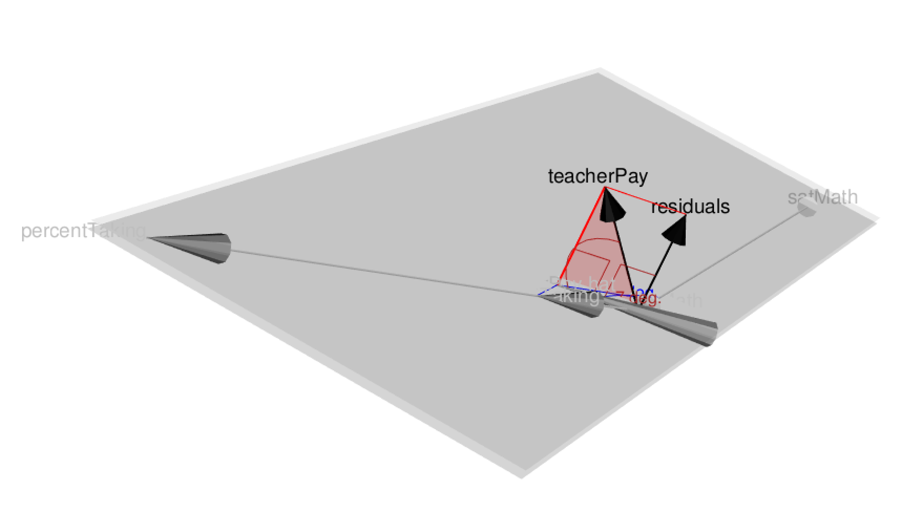
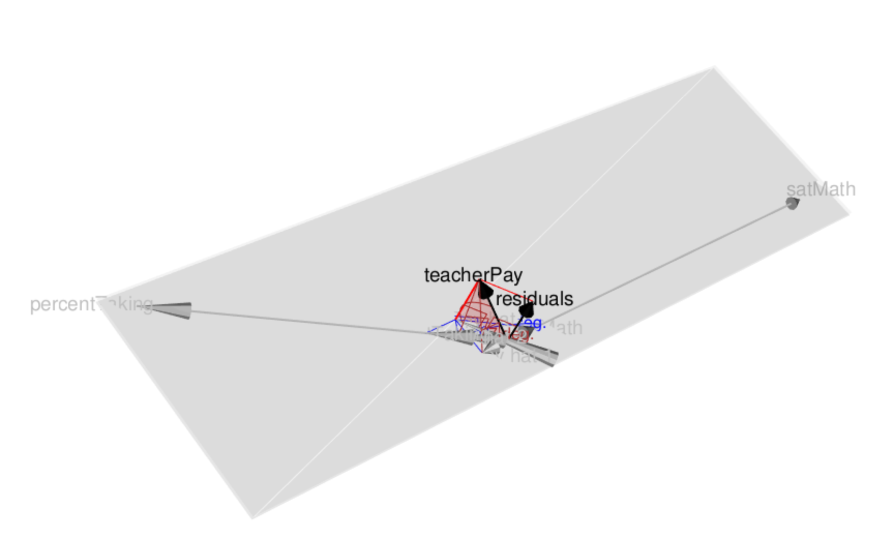
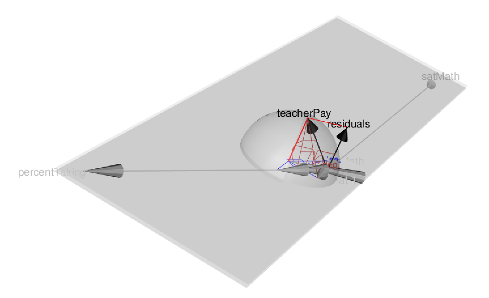

```{r setup, include=FALSE}
knitr::opts_chunk$set(echo = TRUE)
library(matlib)
```

Using R performs matrix computations, work with regression on the States Data. Take the States Data. 
Use the teacherpay as the Response variable and the Sat Math and Percentage as the Explanatory variable.

##### (a) Compute the least-squares regression coefficients, $b = (X'X)^{-1}X'y$
```{r}

States = read.table("~/Desktop/STAT 151A/STAT-151A/hw/hw6/States.txt")
summary(States)
States <- as.data.frame(unclass(States))
attach(States)

X = as.matrix(cbind(1, States$satMath, States$percentTaking))
Y = as.matrix(States$teacherPay)
head(X)
head(Y)

## Estimated Slope Coefficients matrix b = (X'X)^{-1}X'y
beta_hat = solve(t(X)%*%X) %*% t(X) %*% Y
beta_hat_coefficient = as.data.frame(cbind(
  c("Intercept","satMath","PercentageTaking"), beta_hat))
names(beta_hat_coefficient) = c("Slope Coefficient","Estimates")
beta_hat_coefficient
```   


Therefore, $$b_0 = -15.1576165055178, b_1 = 0.0806665874796603, b_2 = 0.235362014333382`$$


##### (b)Calculate the estimated error variance, $s^2_e =\frac{e'e}{(n-k-1)}$(where $e=y-Xb$), and the estimated covariance matrix of the coefficients, $V(b) = s^2_{e}(X'X)^{-1}$

```{r}
# first calculate the residuals
residuals = as.matrix(States$teacherPay - beta_hat[1] - 
                        beta_hat[2]*States$satMath - 
                        beta_hat[3]*States$percentTaking) 
head(residuals)

# then we can calculate the estimated covariance matrix of the coeffients
n = nrow(States)  # number of data points
k = ncol(X)  # number of parameters

# calculate the estimated error variance
SE_variance = (t(residuals)%*%residuals) / (n-k-1)
SE_variance

# calculate the variance-covariance matrix
VCV_matrix = as.numeric(SE_variance) * solve(t(X)%*%X)
VCV_matrix
```

Therefore, the estimated error variance is $$23.95391$$ and the variance-covariance matrix is shown above.


##### (c) Calculate the coefficient Standard Error for this model
```{r}
# take the square root of variance-covariance matrix to find standard
# errors of the estimated coeffients
StdErr = sqrt(diag(VCV_matrix))
StdErr
```

The coefficient standard error are $$[22.26810442 , 0.03903067  ,0.05172311]$$


##### (d) Verify that the lm() model provides us with the same t and pvalues as the matrix formulation. 
```{r}
# conduct the individual hypothesis for the esimated coeffients
# we calculate the t values
t_value = rbind(beta_hat[1]/StdErr[1],
          beta_hat[2]/StdErr[2],
          beta_hat[3]/StdErr[3])
t_value

# calculate the p-value for t test for determining coefficient significance
p_value = rbind(2*pt(abs(beta_hat[1]/StdErr[1]), df=n-k, lower.tail= FALSE),
                2*pt(abs(beta_hat[2]/StdErr[2]), df=n-k, lower.tail= FALSE),
                2*pt(abs(beta_hat[3]/StdErr[3]), df=n-k, lower.tail= FALSE))

p_value

# create a table summary of the matrix formulation and t test
matrix_summary = data.frame(
  "Slope Estimate" = beta_hat,
  "Standard Errors" = StdErr,
  "t value" = t_value,
  "p value" = p_value
)
matrix_summary

estimated_model<-lm(teacherPay~satMath+percentTaking,data=States)
estimated_model_summary = summary(estimated_model)
lm_result = estimated_model_summary$coefficients
lm_result

```
Therefore, by conducting individual t-test for estimated coeffients, we can see that the t values and p values p otained from lm() function and individual t-test are approximately equal (when we around the results to one decimal place). 


##### (e) Create a 3d vector geometric representation for this data.
```{r}
states_vecs = regvec3d(teacherPay ~ satMath + percentTaking, data=States)

# plot 3D vector geometric representation for the regression model and data
plot(states_vecs)

# with the marginal regression
plot(states_vecs, show.marginal = TRUE)

# show the 3D projection of the error hypersphere, scaled so that its 
# projections on the x axes show confidence intervals for the standardized 
# regression coeffients
plot(states_vecs, show.marginal = TRUE, error.sphere="y.hat")
```



